# Lumo Harness

<div align="center">
  <p><strong>在 DeepSeek Harness 之上零侵入生长的智能体平台</strong></p>
  <p>本地单机 · 服务器单例 · 服务器集群</p>

  <p>
    <a href="./LICENSE"></a>
    <a href="https://v2.tauri.app/"></a>
    <a href="https://go.dev/"></a>
    <a href="https://nodejs.org/"></a>
    <a href="https://www.docker.com/"></a>
    <a href="https://kubernetes.io/"></a>
    <a href="./.github/workflows/ci.yml"></a>
    <a href="./.github/workflows/release.yml"></a>
  </p>
</div>

<p align="center">
  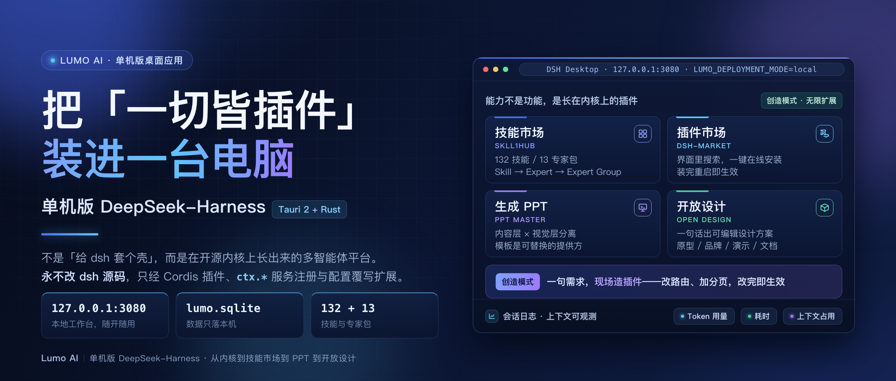
</p>

> **零侵入。** 全部能力只经 [DeepSeek Harness](https://github.com/deepseek-ai/deepseek-harness)（下称 dsh）的原生扩展点实现：Cordis plugin / bundle、`ctx.*` 服务注册、`cordis.patch.yml` 覆写、seam / event / profile。dsh 始终以依赖引入，**绝不 fork / vendor / monkey-patch**。

Lumo Harness 在开源 dsh（Cordis 驱动的「一切皆插件」智能体框架）之上，补上分布式平台缺的那一层：**控制面**（调度、注册表、网关、治理、计量）、**数据面**（dsh 承载节点）、**协同面**（复制的 SessionEvent 日志 + 事件总线）。业务能力以 Cordis 插件形态挂载，基础设施是独立的 Go 服务——两者不互相塞进对方的进程。

同一份内核也有本地形态：桌面**单机版**（`platform/desktop`）用 Tauri 2（Rust）壳拉起一个本机 DSH Web worker，把自包含的 Node、DSH CLI、Web 前端、SQLite 与 Lumo 插件全部打进应用 runtime，工作台跑在 `127.0.0.1:3080`，并显式置 `LUMO_DEPLOYMENT_MODE=local`。技能市场、插件市场、PPT、开放设计都是挂在这个内核上的插件 / 技能——不是「给 dsh 套壳」，而是长在它上面。

**验证判据**（第一铁律的合规证明）：升级 dsh 版本无需 rebase 任何补丁；删除本平台全部代码后，dsh 仍可原样独立运行。

```sh
git -C deepseek-harness describe --tags --dirty   # 不得以 -dirty 结尾
git -C deepseek-harness status --porcelain -uno   # 必须无输出
```

## 为什么使用 Lumo Harness

- **零侵入内核**：dsh 只作为依赖引入，全部能力走公开扩展面；上游升级不需要维护补丁分支，也不存在「跟上游越走越远」的维护债。
- **三档同一引擎**：本地单机、服务器单例、服务器集群共用一套引擎与契约，差异只允许出现在装配层与部署清单——业务代码里没有 `if (standalone)`。
- **能力即插件**：技能、专家包、插件市场、PPT、开放设计、知识库都以 Cordis 插件 / 技能分发，可单独装卸，单个插件崩溃不影响兄弟插件。
- **本地优先**：单机版不启动任何网络中间件，状态只落本机 SQLite；缺失的能力显式返回 `CapabilityUnavailable`，不用别的东西静默模拟。
- **可观测到上下文级**：Token、耗时、系统提示词 / 工具定义 / 注入内容各占多少都可查；可观测性本身也是一个插件。
- **企业级控制面**：RBAC / OPA / Vault、注册表签名与灰度对账、连接器托管 OAuth、企业 OIDC、TOTP 与 Passkey、计量与双树预算。

## 核心能力

| 模块 | 能力 |
| --- | --- |
| 本地单机工作台 | Tauri 2 桌面壳 + 本机 DSH Web worker；SQLite 存储；不装配 PG / Redis / Nacos / MinIO / RocketMQ |
| 技能市场 SkillHub | 技能与专家包分桶（办公 / 内容创作 / 开发编程 / AI Agent / 行业），入口是 `ctx.skills` seam 与渐进式披露的 `SKILL.md`，目录由脚本生成而非手写数组 |
| 插件市场 | 界面内搜索、分类、一键安装；本质是把 `cordis.patch.yml` 以「insert 一行插件」叠进插件树，装完重启生效，另有收藏 / 已安装 / 任务管理与实时更新检查 |
| 创造模式 | 一句话提需求改造工作台：先巡视注册表（服务、导航协议、webServer 接口），再端到端规划，随后改插件 / 加路由 / 加分页，改完即生效 |
| PPT 生成 | 内容层 × 视觉层分离：agent 负责叙事，模板负责字体 / 配色 / 版式，模板本身是可替换提供方 |
| 开放设计 | 从一句话生成**可编辑的设计结构**（布局、组件、信息层级），而不是静态图，可继续迭代 |
| 知识库 | 图 + 向量双 seam（`ctx.knowledge.graph` / `ctx.knowledge.vector`），支持版本化来源、共享编辑与 realm 级隔离 |
| 会话可观测 | Token / 耗时 / 上下文浏览器；历史、fork、resume 与审计全部从 append-only 的 SessionEvent 日志派生 |
| 项目与协作 | 项目实体与成员角色、用量聚合、项目内制品 / 空间 / 自动化；用户自定义流程带 DAG 防环护栏与审核提升 |
| 流程与自动化 | Go FlowEngine：DAG 拓扑执行、事件入口、持久 outbox、运行幂等记录与失败运行的显式重放 |
| 注册表与分发 | 制品签名安装计划、依赖闭包、Stable 通道灰度与回滚；Provisioner 验签、对账并原子物化到节点 |
| 治理与安全 | 组织 / 角色 / 部门与授权期限、技能授权、连接器凭证入 Vault、OPA 策略、企业 OIDC、TOTP、Passkey |
| 计量与预算 | 计量收敛在 `ctx.llm` 单一截面；用户树与项目树同事务扣减，任一超限即拒 |
| 集群调度 | Scheduler 支持 EDF 截止时间、加权公平队列、能力值匹配、硬反亲和与安全抢占 |
| 跨节点协同 | Seam Proxy 把平台新增的能力 seam 网络可达；远程子智能体放置、`ctx.jobs` 跨节点取消、复制的会话日志 |

## 界面与功能

以下截图取自本地单机版的真实运行态。截图中的技能 / 插件数量与版本是运行快照，以实际版本为准。

### 工作台与会话

| 界面 | 说明 |
| --- | --- |
| 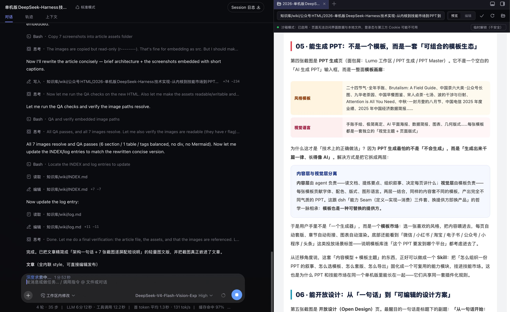 | **会话工作台**：左侧是会话与轨道（对话、一次次工具调用与轨迹），右侧直接在浏览器里预览产物，底部是上下文、耗时与缓存命中率统计。 |
| 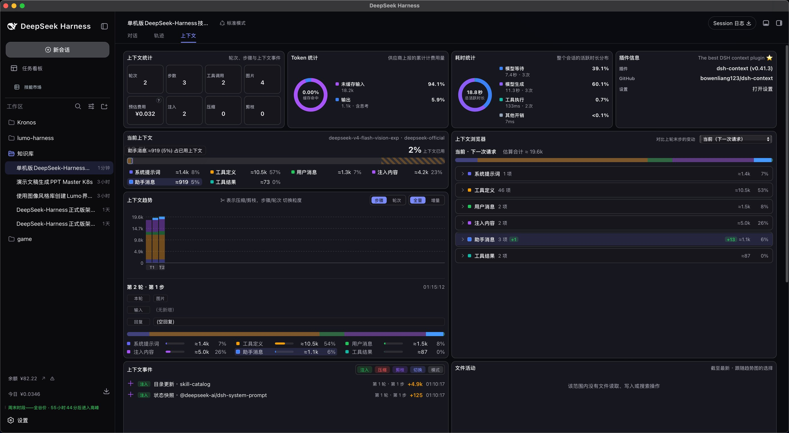 | **上下文可观测**：系统提示词、工具定义、用户消息、注入内容各占多少一目了然。能看见上下文被怎么消耗，才谈得上压缩、瘦身，把它变成可靠的生产工具。 |

### 技能市场与专家包

| 界面 | 说明 |
| --- | --- |
| 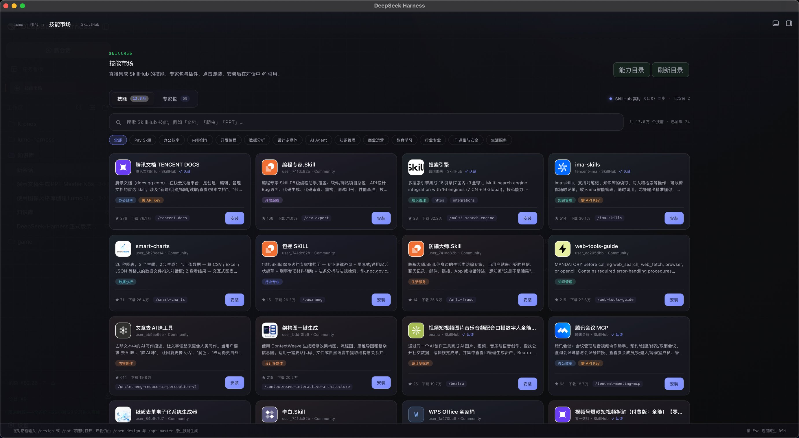 | **技能市场**：技能按办公 / 内容创作 / 开发编程 / AI Agent / 行业分桶，可查看、安装与更新。 |
| 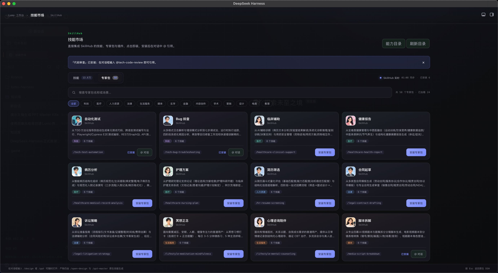 | **专家包**：分层为 Skill → Expert（技能 + MCP + 知识 + Harness 配置）→ Expert Group。装一个专家包，本地 Agent 立刻获得该领域的技能组合。 |

### 插件市场与更新

| 界面 | 说明 |
| --- | --- |
| 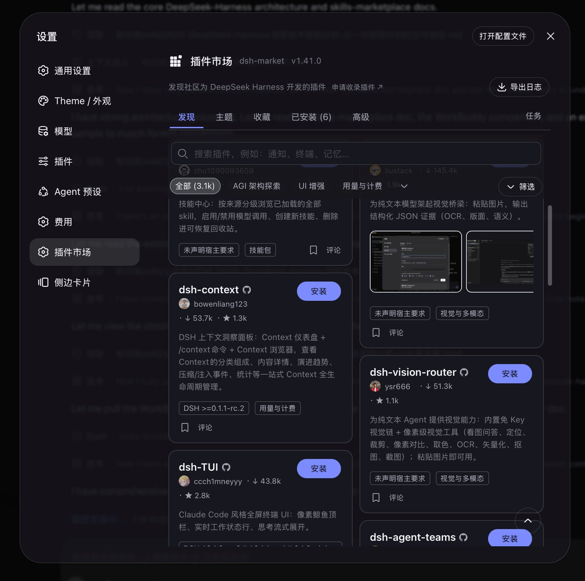 | **插件市场**：界面内搜索、按分类筛选、点「安装」在线装插件；卡片显示作者、下载量与版本要求，并有收藏 / 已安装 / 任务管理。 |
| 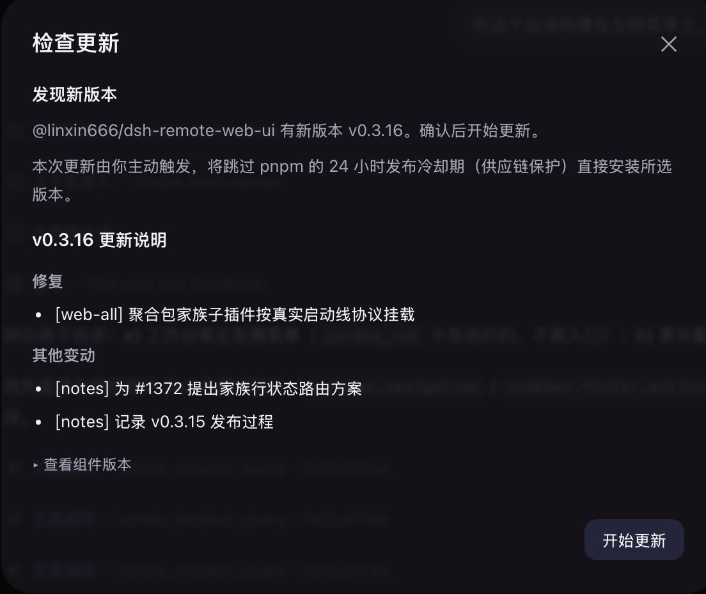 | **实时更新**：底座与已装插件都支持检查更新，列出版本号与更新说明，由你主动确认后升级，也可以先核对组件版本。 |

### 创造模式与知识库

| 界面 | 说明 |
| --- | --- |
| 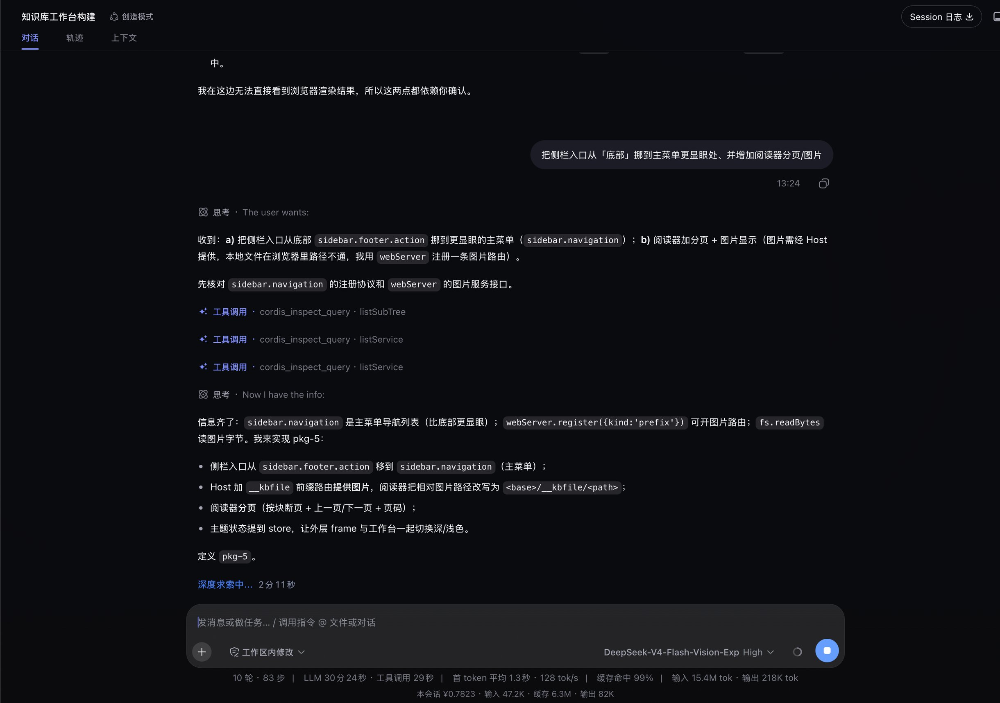 | **创造模式**：它不只「用」插件，还能「造」插件——巡视注册表 → 端到端规划 → 改插件 / 加路由 / 加分页，改完即生效；工具调用、思考链路与耗时全程可见。 |
| 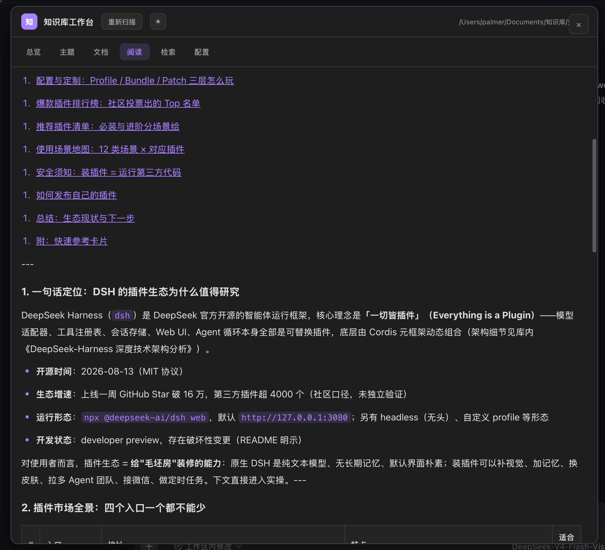 | **知识库工作台**：把库内文档做成可浏览、可阅读、可检索的本地工作台（总览 / 主题 / 文档 / 阅读 / 检索 / 配置）。 |

### 生成 PPT 与开放设计

| 界面 | 说明 |
| --- | --- |
| 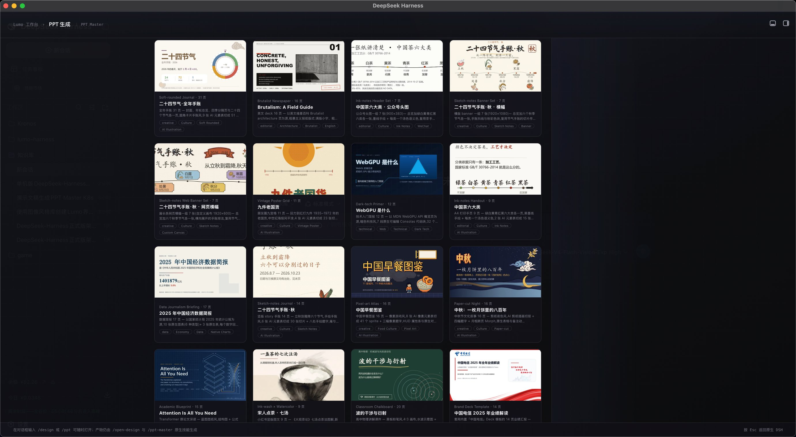 | **PPT 生成**：同样的内容套不同模板会产出气质完全不同的结果；模板本身也是一种可替换提供方。 |
| 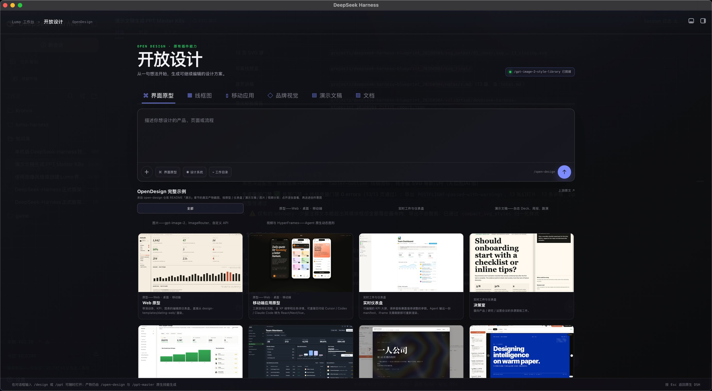 | **开放设计**：界面原型 / 线框图 / 移动应用 / 品牌视觉 / 演示文稿 / 文档，生成的是可继续迭代的设计结构，而非静态图。 |

### 设置与主题

| 界面 | 说明 |
| --- | --- |
| 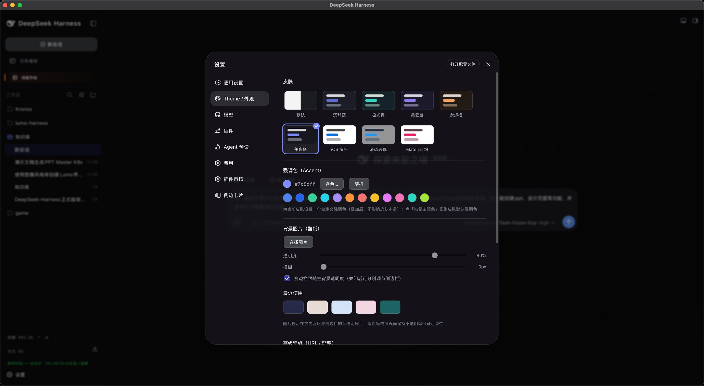 | **插件化前端**：皮肤、强调色、壁纸皆为可配置项。前端用 React + Vite，数据来自 Session 事件流投影，Slot 渲染器让单个插件崩溃不影响兄弟插件。 |

更多推广图、高清原图与导览正文见 [`docs/guide/README.md`](./docs/guide/README.md)。

## 架构

```text
Lumo Harness
│
├── 控制面 · 独立 Go 服务，可水平扩展
│   ├── scheduler · registry · llm-gateway · connector-gateway
│   ├── governance · usage-ledger · flows · projects · collaborator
│   └── 中间件：Nacos（注册/配置）· RocketMQ（消息/A2A）· OPA · Vault
│
├── 数据面 · dsh 承载节点
│   ├── 每个节点跑一份未修改的 dsh，并挂载平台新增的能力 seam provider
│   └── 存储：PostgreSQL · Doris · Nebula · Milvus · MinIO · Redis
│
├── 协同面
│   ├── 复制的 SessionEvent 日志：模型上下文 / 审计 / 跨节点状态的同一份真相
│   └── 事件总线（RocketMQ A2A）· 异步挂起恢复 · 多端协作
│
└── 界面 · 不修改 dsh 源码
    ├── 以 dsh.client 扩展机制挂载进 dsh 原生 AppFrame
    │   └── 右下角「Lumo 运营面」：项目 · 权限 · 流程 · 连接器 · 集群 · 插件能力
    └── 桌面单机形态：Tauri 2 壳 + 本机 DSH Web worker + SQLite（无任何中间件）
```

界面在 dsh 原生 AppFrame 内以 `dsh.client` 扩展机制挂载：右下角「Lumo 运营面」把项目、权限、流程、连接器、集群与插件能力收在同一个 DSH Web 页面里，不修改 `deepseek-harness/` 源码。

三档形态的取舍是：**本地单机不启动任何网络中间件**；服务器单例把中间件收敛到单实例；服务器集群把自研服务多实例化，用于生产以及在本机调试分布式行为。

> 完整设计（分层、硬规矩、安全模型、SLO、故障预案）见 [`docs/architecture.md`](./docs/architecture.md)——README 不重复设计结论。

## 三档产品形态

| 形态 | 载体 | 存储 | 中间件 | 适用范围 |
| --- | --- | --- | --- | --- |
| 本地单机 | Rust/Tauri 桌面包（`platform/desktop`） | SQLite | 无 | 个人工作台、本机 Agent、离线技能 |
| 服务器单例 | Docker Compose（`platform/deploy/compose.standalone.yml`） | PostgreSQL | Redis / MinIO / RocketMQ / Nacos | 单服务器团队服务 |
| 服务器集群 | Compose + Helm（`platform/deploy/compose.cluster.yml`、`helm/lumo-platform`） | PostgreSQL | Redis / MinIO / RocketMQ / Nacos | 跨用户委派、桌面节点、弹性调度 |

## 快速开始

### 1. 下载安装包（推荐）

前往 [GitHub Releases](https://github.com/Lumonote/lumo-harness/releases) 下载对应平台的安装包：

| 平台 | 安装包 | 说明 |
| --- | --- | --- |
| macOS · Apple Silicon | `DeepSeek-Harness_*_aarch64.dmg` | M 系列芯片 |
| macOS · Intel | `DeepSeek-Harness_*_x64.dmg` | Intel 芯片 |
| Windows | `*.exe`（NSIS） | x64 |

安装包里已经内置本地 runtime（自包含 Node、DSH CLI、Web 前端、SQLite 与 Lumo 插件），**不需要**单独安装 Node.js、Rust 或 Python，装完双击即用。

> 打包**只支持手动触发**：在 Actions 页面运行 `release` workflow，再选择要构建的分支或 tag。选择 `main` 或 tag `v*` 产出正式产物，其他分支产出带 `-test` 后缀的桌面测试包；只有 tag `v*` 会把安装包附到 GitHub Release，平时推送到分支的产物只留在 Actions Artifacts 中（保留期有限）。

#### macOS：安装后第一次打不开怎么办

社区构建没有购买 Apple 开发者证书，安装包使用 **ad-hoc 签名**（等同于未签名），也没有送给 Apple 做公证（notarization）。所以 Gatekeeper **必然会拦一次**，你看到的多半是下面几种提示之一：

- 「"DeepSeek Harness" 无法打开，因为 Apple 无法检查其是否包含恶意软件。」
- 「"DeepSeek Harness" 无法打开，因为无法验证开发者。」
- 「"DeepSeek Harness" 已损坏，无法打开。你应该将它移到废纸篓。」

这三种提示说的是同一件事：**系统无法验证开发者身份**，而不是安装包真的损坏或下载失败。按下面的顺序处理，第 1 步不行再往下走：

1. **拖入「应用程序」**：打开 dmg，把 App 拖进「应用程序」。
2. **右键打开**：在「应用程序」里 **按住 Control 点击（或右键）** App → 选「打开」→ 在弹窗里再点一次「打开」。注意：直接双击只会出现「移到废纸篓 / 完成」，不会给你「打开」按钮。
3. **在系统设置里放行**：「系统设置 → 隐私与安全性」，滚到底部「安全性」区域，会看到被拦截的提示，点「仍要打开」并输入登录密码确认。（macOS 15 起弹窗不再提供「打开」，只能走这里。）
4. **移除隔离属性**（提示「已损坏」或前几步都无效时最有效）：

   ```bash
   xattr -dr com.apple.quarantine "/Applications/DeepSeek Harness.app"
   open "/Applications/DeepSeek Harness.app"
   ```

   若直接从 dmg 挂载卷里运行，把路径换成挂载卷下的 App，例如
   `xattr -dr com.apple.quarantine "/Volumes/DeepSeek Harness/DeepSeek Harness.app"`。
5. **仍然打不开**：先确认安装包与芯片架构匹配（Apple Silicon 用 `aarch64` 包，Intel 用 `x64` 包），或改用下面的「从源码运行」。

几点补充：

- **只从本仓库 Releases 下载。** 第三方转发的包无法核对来源，也不要为了省掉一次弹窗就全局关闭 Gatekeeper。
- 放行只需要做一次，之后系统会记住这个选择。
- 想彻底消除弹窗，需要 Apple Developer Program 会员（99 美元/年）做 Developer ID 签名 + 公证；社区构建不做这件事，属于预期行为，不是本项目可以「修好」的缺陷。

#### Windows：SmartScreen 提示

Windows 安装包同样未做代码签名，SmartScreen 会提示「Windows 已保护你的电脑」。点「更多信息」→「仍要运行」即可继续安装。

#### 卸载与本地数据

应用数据不在 App 包内部，卸载应用后仍然保留：

| 平台 | 数据目录 |
| --- | --- |
| macOS | `~/Library/Application Support/Lumo/` |
| Windows | `%LOCALAPPDATA%\Lumo\` |

其中 `lumo.sqlite` 保存平台状态，`dsh/sessions` 保存对话日志，`runtime/skills` 保存已安装的技能。需要彻底清理时，先把应用拖入废纸篓，再删除上面的目录（**删除前请先备份**）。

### 2. 从源码运行（本地单机）

环境要求：Node `^22.19 || >=24`、pnpm `11.7.0`、Rust stable 与 Tauri 系统依赖，以及一份可用的上游 dsh checkout。

```sh
cd platform/upstream && ./install-components.sh   # 安装固定上游技能快照（缺失时按 pin 提交拉取）
cd ../desktop && ./preview-local.sh               # 用仓库内的 DSH 运行时启动本地应用
```

`preview-local.sh` 会把 SQLite 写到 `~/Library/Application Support/Lumo/lumo.sqlite`；如果 Web 前端产物不存在，它会先自动构建。只想产出应用包：

```sh
cd platform/desktop
cargo tauri build --debug --bundles app
```

Windows（Git Bash）拉取上游快照时需要指定目标：`./install-components.sh --target win-x64`。桌面打包边界与细节见 [`platform/desktop/README.md`](./platform/desktop/README.md)。

### 3. 服务器单例 / 集群

```sh
./platform/deploy/up.sh standalone -d --build     # 单例
./platform/deploy/up.sh cluster -d --build        # 集群（自研服务多实例）
```

启动后打开 <http://127.0.0.1:4173>；Lumo 插件会在 DSH 原生页面内提供右下角「Lumo 运营面」，运营入口为 <http://127.0.0.1:4173/lumo/ops>。生产用 Helm 渲染：

```sh
helm template lumo platform/deploy/helm/lumo-platform
```

启动前建议先跑只读预检（不启动容器、不读取 Secret 正文），`--strict` 会拒绝开发默认凭据：

```sh
./platform/deploy/preflight-deployment.sh cluster --strict
```

部署清单、三档形态与设备 TLS 接入见 [`platform/deploy/README.md`](./platform/deploy/README.md)，全部环境变量与配置契约见 [`docs/configuration.md`](./docs/configuration.md)。

## 仓库结构

| 路径 | 内容 |
| --- | --- |
| `platform/control-plane/` | Go 控制面服务：scheduler、registry、llm-gateway、connector-gateway、governance、usage-ledger、flows、projects、collaborator（`observability` 是共享库） |
| `platform/data-plane/dsh-node/` | dsh 承载节点 |
| `platform/dsh-plugins/` | 以 Cordis 插件形态挂载的业务能力（技能、连接器、知识库、计量、Lumo 运营面……） |
| `platform/desktop/` | Rust/Tauri 本地单机壳与 runtime 装配 |
| `platform/desktop-assets/` | 桌面壳使用的前端产物与图标素材 |
| `platform/dsh-overrides/` | 运行时覆盖层（不修改 dsh 源码的装配入口） |
| `platform/deploy/` | Compose 拓扑、Helm chart、迁移与预检脚本 |
| `platform/console/` | 控制台前端 |
| `platform/shared/`、`platform/upstream/` | seam 契约 / 清单，与上游组件快照安装 |
| `docs/` | 中文设计文档：架构、路线图、评审、编号专题规格 |
| `docs/guide/` | 产品导览与物料（导览正文、推广图、截图素材） |
| `deepseek-harness/` | 上游 dsh 只读 checkout，**不提交 Git**（`.gitignore` 首行忽略） |

## 构建与发布

### 一键构建：`platform/build.sh`

本地与 CI 共用这一份脚本，避免「本地能跑、CI 产出不一样」。

```sh
./platform/build.sh                            # 12 个 Docker 镜像（默认）
./platform/build.sh --targets darwin-arm64     # macOS 桌面包（dmg）
./platform/build.sh --targets win-x64          # Windows NSIS 安装包
./platform/build.sh --targets all              # 镜像 + 宿主架构桌面包
./platform/build.sh --dry-run --targets all    # 只打印将执行的命令
```

`--push` 需配合 `--registry`，推送前会校验 `platform/package.json`、`Chart.yaml`、`tauri.conf.json` 三处版本一致，不一致直接拒绝。桌面包必须在同平台同架构宿主上构建（native Python wheel 与 Rust 壳都不可跨架构）。Windows 只产出 NSIS 安装包：runtime 约 1.3GB，WiX `light.exe` 生成 CAB 会失败，NSIS 可正常打包同一份 payload。

### 发布：`.github/workflows/release.yml`

打包**只支持手动触发**：push / tag 不再自动运行。在 GitHub Actions 页面选择 `release` → **Run workflow**，再选择要构建的分支或 tag。

| 手动选择的分支 / tag | 产物 |
| --- | --- |
| `main` 或 tag `v*` | macOS / Windows 安装包上传为 Actions artifact |
| 其他分支 | 桌面**测试包**（artifact 名带 `-test` 后缀） |
| tag `v*` | 除 artifact 外，安装包附到 GitHub Release |

门禁（typecheck / 测试 / `go vet` / 第一铁律校验）由 [`.github/workflows/ci.yml`](./.github/workflows/ci.yml) 单独负责，与产物职责分离。发布前需保证 tag 名（如 `v0.1.0`）与 `platform/package.json`、`Chart.yaml`、`tauri.conf.json` 三处版本号一致。

## 测试与质量检查

平台 TS 侧：

```sh
cd platform
pnpm install
pnpm run test        # vitest 单元测试
pnpm run typecheck   # tsc 严格模式
```

Go 服务按模块各自校验：

```sh
cd platform/control-plane/<service>
go build ./... && go vet ./... && go test ./...
```

涉及 seam 的改动，必须同时补充 `platform/shared/seam-contracts/` 的契约测试，并保证 Local 与 Standalone Provider 双向通过。提交 PR 前请自行跑通受影响模块的测试与类型检查。

## 文档

| 文档 | 内容 |
| --- | --- |
| [`docs/README.md`](./docs/README.md) | 文档地图与阅读路径（**从这里开始**） |
| [`docs/architecture.md`](./docs/architecture.md) | 唯一权威技术规范（§0–§15） |
| [`docs/roadmap.md`](./docs/roadmap.md) | 实施蓝图与端到端流程（§16–§17） |
| [`docs/design-review.md`](./docs/design-review.md) | 独立评审：P0 风险与替代落地顺序 |
| [`docs/implementation-status.md`](./docs/implementation-status.md) | 已落地能力与外部集成边界 |
| [`docs/configuration.md`](./docs/configuration.md) | 全部环境变量与配置契约 |
| [`docs/cluster-management.md`](./docs/cluster-management.md) | 集群管理接口与权限边界 |
| [`platform/deploy/README.md`](./platform/deploy/README.md) | 部署清单、三档形态、设备 TLS 接入 |
| [`platform/desktop/README.md`](./platform/desktop/README.md) | 桌面打包边界与构建细节 |
| [`platform/CONTRIBUTING.md`](./platform/CONTRIBUTING.md) | `platform/` 开发约定 |
| [`docs/guide/2026-single-node-deepseek-harness.md`](./docs/guide/2026-single-node-deepseek-harness.md) | 产品导览《把「一切皆插件」装进一台电脑》 |
| [`docs/guide/README.md`](./docs/guide/README.md) | 导览物料索引（截图、高清原图、推广图） |

## 贡献

欢迎提交 Issue、改进文档和 Pull Request。动手之前请先读 [`platform/CONTRIBUTING.md`](./platform/CONTRIBUTING.md)（`platform/` 开发约定），并注意三条硬约束：

1. **绝不修改 `deepseek-harness/` 源码（第一铁律）。** 全部能力只经 dsh 公开扩展面实现：Cordis 插件（独立包，import 公开 API）、`ctx.*` 注册 service / event / seam provider、`cordis.patch.yml` 配置覆盖、preset / `isolate` realm 组合、以依赖方式引入 dsh。若某个需求看起来必须改 dsh，那是设计错了——请开 Issue 讨论，而不是绕过这条规则。
2. **同引擎不同拓扑。** 业务代码禁止出现 `if (standalone)` 一类分支，差异只允许存在于装配层与部署清单；缺失能力显式拒绝（`CapabilityUnavailable`），严禁静默模拟。
3. **每个 seam 必须配契约测试**，Local 与 Standalone Provider 双向通过。

请保持改动聚焦（一个 PR 只做一件事），在描述里给出复现步骤与验证结果，并确认第一铁律的两条校验命令仍然通过。

## 捐赠一点 token

Lumo Harness 是靠 token 喂大的——每一次上下文压缩、每一轮多智能体协作，背后都是实打实的模型推理开销。

如果它帮到了你，欢迎**捐赠一点 token**：所有打赏都会用来补贴模型推理与构建、签名、分发的成本，让它能继续跑下去。

完全自愿，不构成任何服务对价，不影响功能与授权。

<p align="center">
  
</p>

## 许可

本项目以 [MIT License](./LICENSE) 发布，Copyright (c) 2026 Lumonote。

例外与归属：

- `platform/dsh-plugins/open-design/` 保持 **Apache-2.0**——它封装的上游 [OpenDesign](https://github.com/nexu-io/open-design) 项目为 Apache-2.0，单方面改为 MIT 会抹掉来源归属。
- 上游 [`deepseek-harness`](https://github.com/deepseek-ai/deepseek-harness) 自身亦为 MIT。
- `platform/upstream/skills/` 下的技能快照按各自上游许可证分发，来源仓库、pin 提交与许可证见 [`platform/upstream/skill-sources.json`](./platform/upstream/skill-sources.json)。

## 免责声明

Lumo Harness 是开源软件，本身**不提供**任何模型服务、数据源或云资源。你需要自行准备 LLM Provider 凭据并遵守其服务条款；模型输出可能不准确，请人工核验后再用于生产环境。部署方需自行负责凭据保管、数据合规、访问审计与容量规划——生产上线前请按 [`docs/architecture.md`](./docs/architecture.md) 的安全模型与 [`platform/deploy/README.md`](./platform/deploy/README.md) 的上线门槛逐项核对。本项目不构成任何形式的商业承诺或专业建议。
