# 单机版 DeepSeek-Harness：把「一切皆插件」装进一台电脑

**AI 智能体 · 单机版落地**

把官方「一切皆插件」的内核装进一台电脑：技能市场、在线装插件、生成 PPT、开放设计

> **一句话架构：** 它不是「给 dsh 套个壳」，而是**在开源 deepseek-harness 之上长出来的多智能体平台**——铁律是**永不改 dsh 源码**，只通过 Cordis 插件 / bundle、**ctx.\*** 服务注册、**cordis.patch.yml** 覆写、以 npm 依赖方式扩展。单机版用 **Tauri 2（Rust）做壳**：Rust 壳把一个**本地 DSH Web worker 作为子进程拉起**（自包含的 Node + DSH CLI + Web 前端 + SQLite + Lumo 插件，全部打进 .app 的 runtime），工作台就跑在 `127.0.0.1:3080` 上；环境置 `LUMO_DEPLOYMENT_MODE=local`，数据只落 `lumo.sqlite`。技能市场、插件市场、PPT、开放设计——全是挂在这个内核上的 Lumo 插件 / 技能。

## 01 · 设置 / 主题面板：插件化的前端

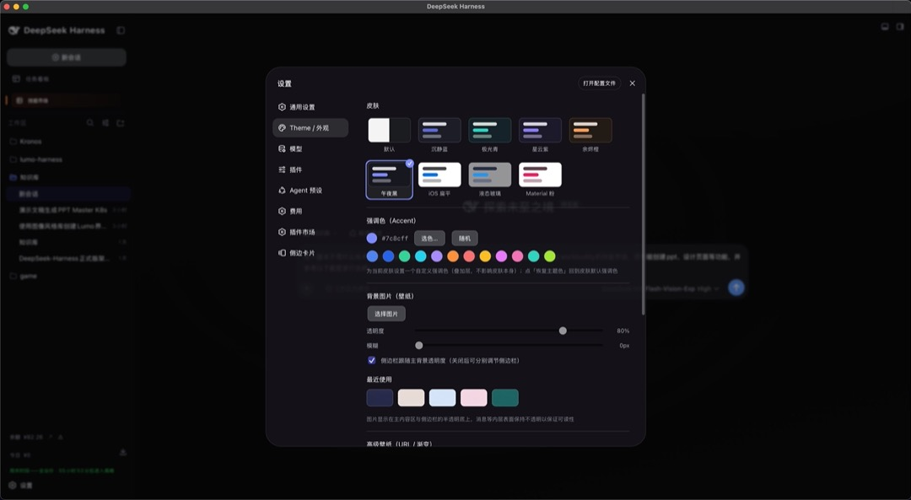

皮肤、强调色、壁纸全是**可配置项**。前端用 React 18 + Vite，数据来自 session 事件流投影；Slot 渲染器让**单个插件崩溃不影响兄弟插件**。

## 02 · 技能市场 Skll1hub：像 WorkBuddy 的 SkillHub，但长在本地

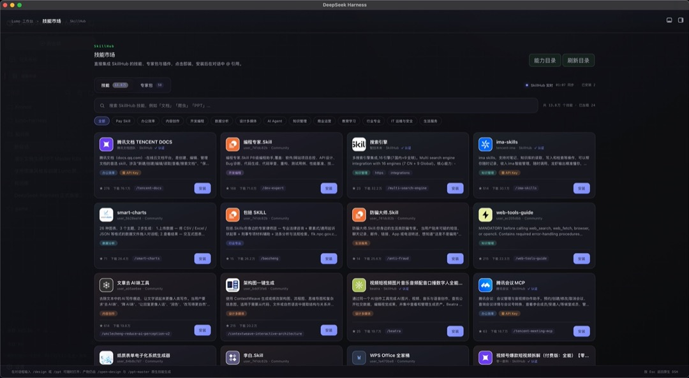

技能 132 个、专家包 13 个，按「办公 / 内容创作 / 开发编程 / AI Agent / 行业」分桶。技能入口是 **ctx.skills seam + tool-skill**（渐进式披露的 SKILL.md），目录由 **skill-catalog + gen-\*-catalog** 脚本生成，不是手写数组。

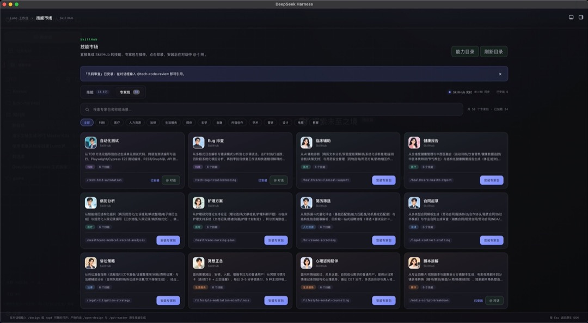

第二页是行业化的**专家包**（科技 / 医疗 / 人力资源 / 法律 / 生活服务 / 设计 / 电商……）。分层和 WorkBuddy 一致：**Skill → Expert（技能+MCP+知识+Harness 配置）→ Expert Group**。装一个专家包，本地 Agent 立刻会看病历、写合同、筛简历。

## 03 · 插件市场：在线一键安装

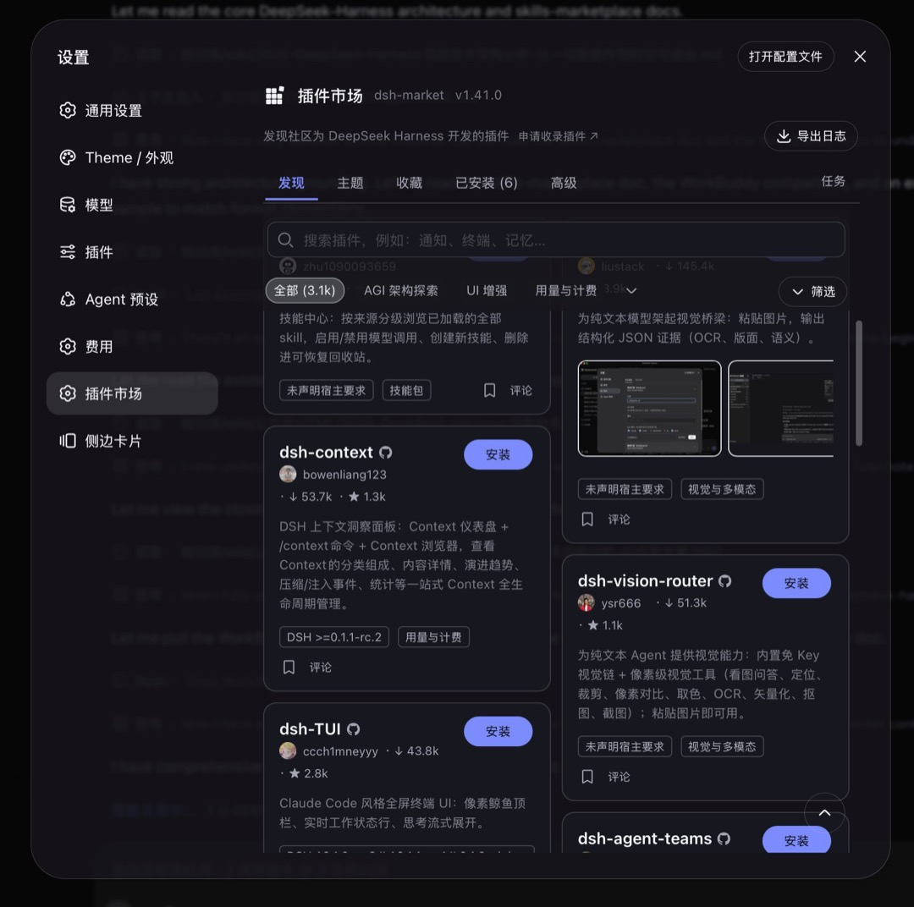

跟技能市场并排还有一个**插件市场（dsh-market）**，支持**在界面里直接搜索、按分类（UI 增强 / 用量与计费 / 视觉增强）筛选、点「安装」在线装插件**。卡片显示作者、下载量、Star、版本要求（如 DSH ≥ 0.1.1-rc.2）。本质是把 **cordis.patch.yml 以「insert 一行插件」方式叠进插件树**——装完重启即生效，还能「收藏 / 已安装 / 任务」管理。

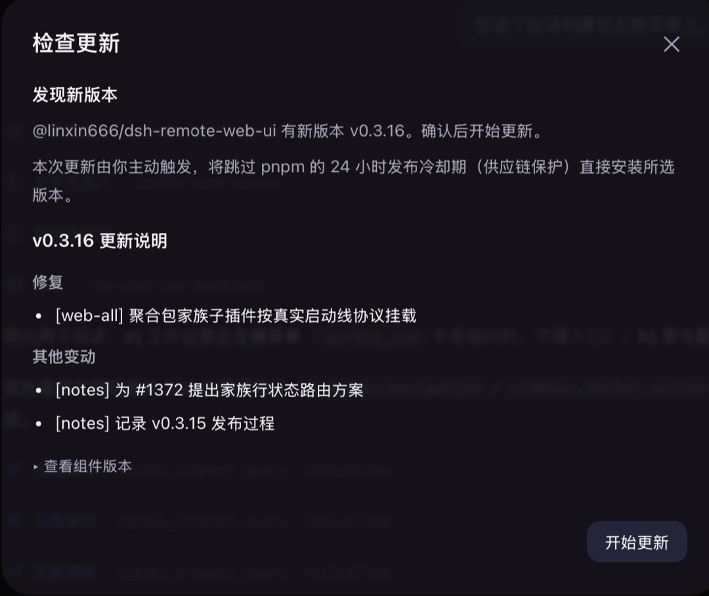

底座和插件都支持**实时更新**：发现新版本会弹出「检查更新」面板，列出版本号、更新说明（修复 / 其他变动）与「开始更新」，由你主动触发、确认后一键升级；旁边还能「查看组件版本」核对底座与已装插件。

## 04 · 创造模式：插件能无限扩展

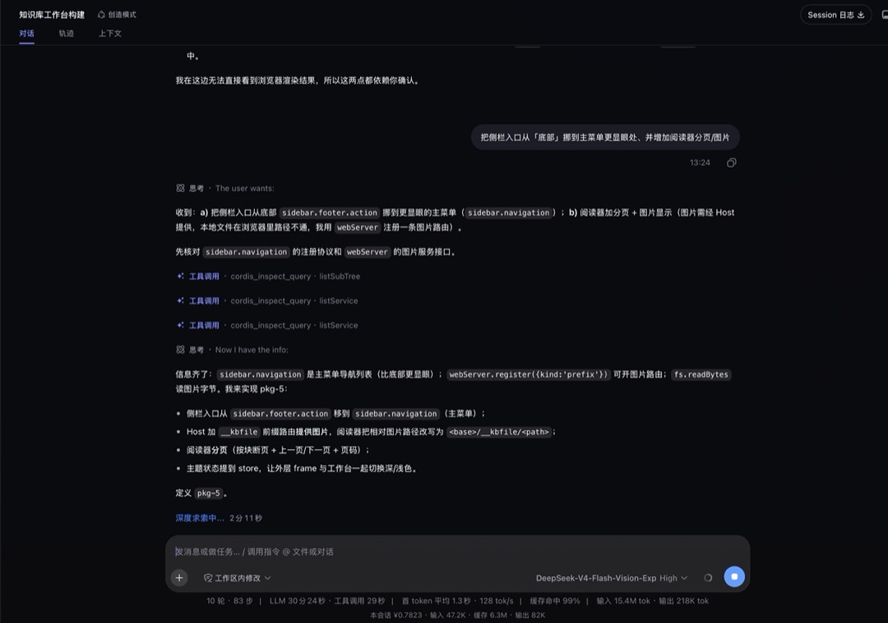

更关键的是，它能**实时改造自己**——不只是「用」插件，还能「造」插件。把需求一句话丢给它（比如「把侧栏入口从底部挪到主菜单更显眼处、并增加阅读器分页/图片」），它会先**巡视注册表**（cordis_inspect_query 看服务、看 sidebar.navigation 协议与 webServer 接口），再端到端规划（pkp-5），然后改插件、加路由、加分页，改完即生效。工具调用、思考链路、耗时在对话里全程可见。

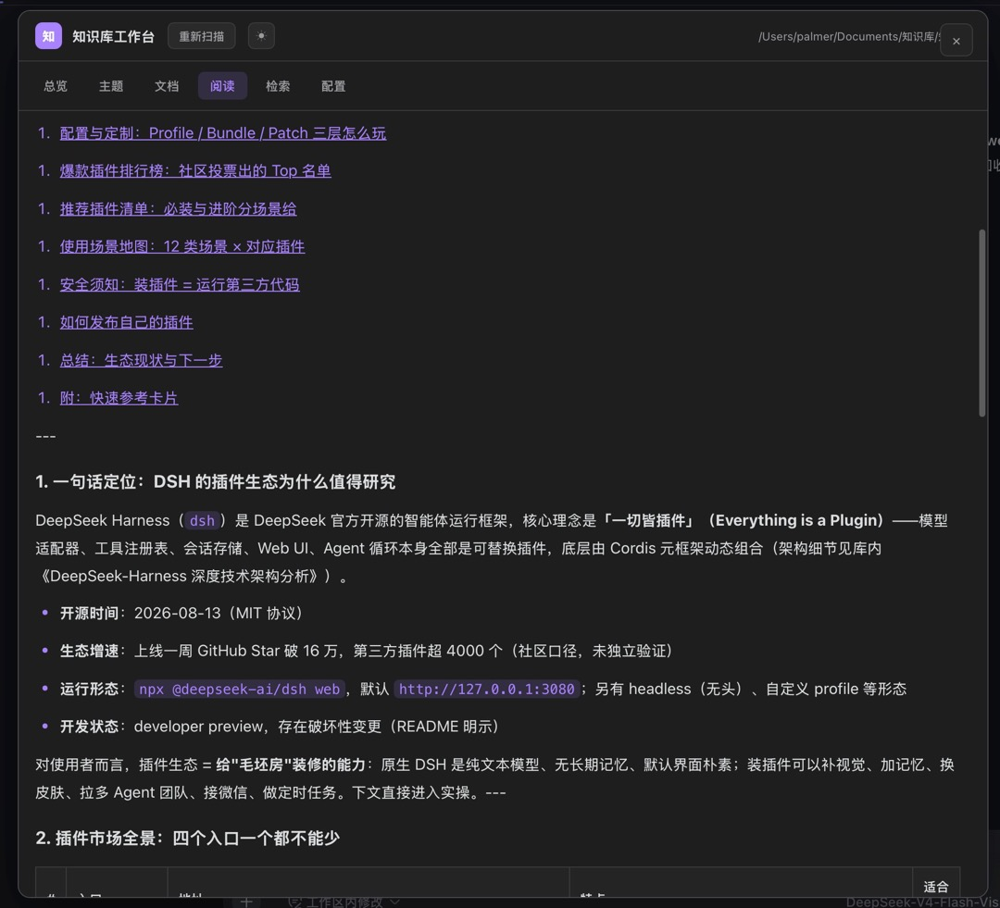

这是创造模式在「知识库工作台构建」里的落点：把库内文档做成可浏览、阅读、检索的本地工作台（总览 / 主题 / 文档 / 阅读 / 检索 / 配置），还能在文档上标记「适合」。你一句需求，它就把「想用的东西」改造成真正长在自己电脑上的工作台。

## 05 · 能生成 PPT：模板市场，不是单个生成器

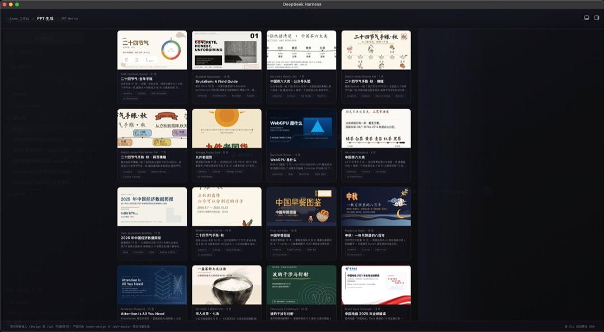

做法是**内容层 × 视觉层分离**：agent 负责提炼要点、组织叙事；模板负责字体、配色、版式、图形语言。同样的内容套不同模板，产出气质完全不同的 PPT——模板本身也是一种「可替换提供方」。

## 06 · 能开放设计：从一句话到「可编辑的设计方案」

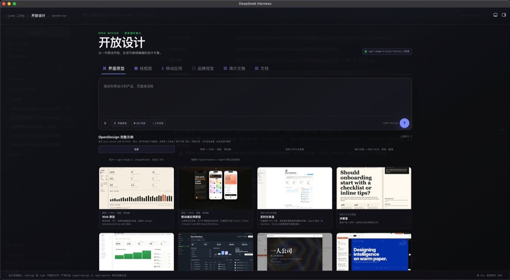

「**从一句话开始，生成可编辑的设计方案**」：界面原型 / 线框图 / 移动应用 / 品牌视觉 / 演示文稿 / 文档。生成的是**设计结构**（布局、组件、信息层级）而非静态图，可以继续改、迭代——由多模态 + Agent 布局 + 代码生成多个能力 seam 协同。

## 07 · 会话日志：上下文可观测

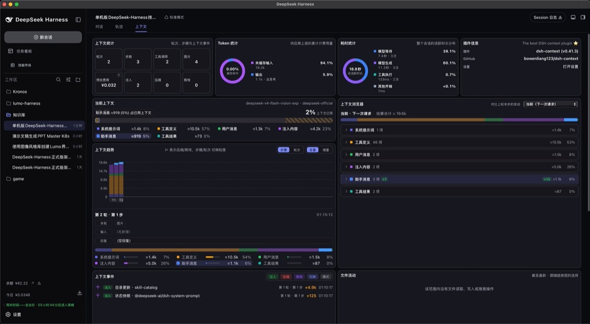

Token / 耗时 / 上下文浏览器一应俱全（系统提示词、工具定义、用户消息、注入内容各占多少）。**可观测性本身也是插件**（如 dsh-context）——能看见上下文被怎么消耗，才谈得上压缩、瘦身、把它变成可靠的生产工具。

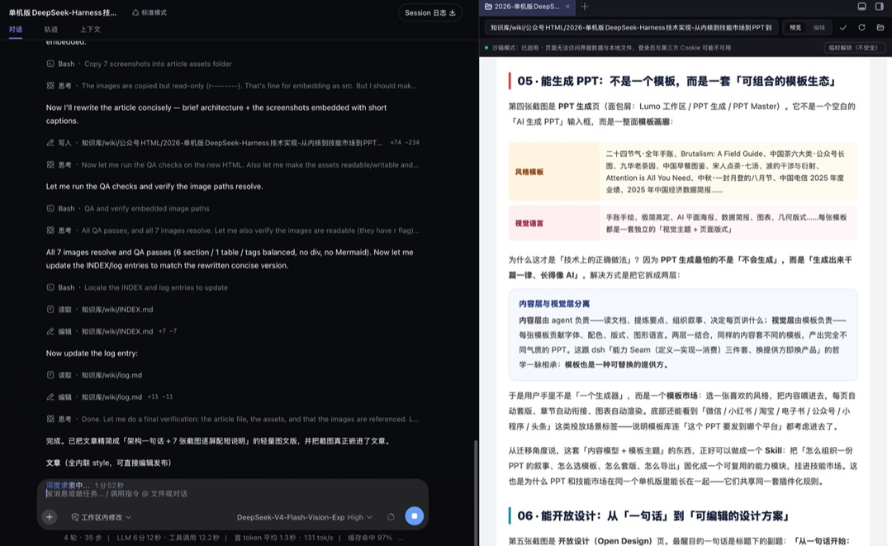

真实的工作界面：左侧是会话 / 轨道（对话、一次次的工具调用与轨迹），右侧直接在浏览器里预览产物，底部是上下文、耗时与**高缓存命中率**统计——写文章的每一步，都被可观测地记了下来。

> **一句话记住它**
>
> 单机版不是「网页套壳」，而是把官方「一切皆插件」的内核装进一台电脑，再把技能市场、插件市场、PPT、开放设计当作插件长上去。

本文基于 lumo-harness 源码（platform/desktop 的 Rust/Tauri 壳与 main.rs、platform/dsh-plugins、platform/upstream、docs/architecture.md）及上游 deepseek-harness 官方文档（docs/architecture.zh.md、packages/boot、packages/skills、apps/web）核写：单机版 = Tauri 2（Rust）壳拉起本地 DSH Web worker（SQLite only），在 deepseek-harness 之上以 Cordis 插件零侵入扩展；截图中的技能/插件数量与版本为运行态快照，以实际版本为准。
